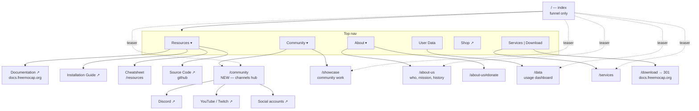

# freemocap.org — Proposed Site Architecture

Working document. Not a spec, not final. Edit freely.

**Constraints this plan respects**

- v2 of the app is mid-release and the docs are not updated yet.
- `docs.freemocap.org` owns Download for now. `/download` stays a 301.
- A local download page is wanted eventually but is out of scope here.
- This plan is about getting the org site into a shape that makes those
  moves easy later, not about making them now.

---

## The core problem

The site is running two information architectures at the same time.

There is an older **one-page scrolling site**, where the index holds all nine
sections and the footer points at anchors inside it. And there is a newer
**multi-page site**, with Services, Showcase, Resources, About Us, and User
Data as real pages. Each time a page got built, the index section it replaced
stayed where it was. Nothing was ever retired.

The result is that a concept has no single home:

| Concept | Where it currently lives |
|---|---|
| Services | Nav split button → `services.html`, About Us dropdown → `services.html`, index `#services` section → contains a button to `services.html`, footer → index `#services` |
| Community | Nav dropdown parent → index `#community`, dropdown child → `showcase.html`, index `#community` section with 4 cards, `resources.html` cards, footer → index `#community` |
| Resources | `resources.html` has 6 cards, nav dropdown has 3 items, footer has 2. No two lists agree. Cheatsheet is in the dropdown but not on the Resources page. |
| Mission | Index `#mission` section only, though `about-us.html` is where it belongs |
| Discord | Index community card, Resources card, Showcase intro, Showcase CTA, footer, nav. Six places. |

The fix is not to rearrange the menus. It is to decide, for each concept, which
page owns it, and make everything else a pointer to that page.

---

## The proposed model

**One canonical owner per concept. The index is a funnel, not a container.**

Every index section becomes one of two things: content that exists nowhere else
(How It Works, Why Choose FreeMoCap), or a short teaser that links to the page
that owns it. No index section duplicates a page.

Three audiences drive the nav shape:

1. **Run it** — Download, Documentation, Installation, Cheatsheet
2. **Evaluate it** — How It Works, Showcase, User Data
3. **Fund or hire you** — Services, Donate, About

---

## Proposed structure



---

## Canonical owners

| Concept | Canonical home | Notes |
|---|---|---|
| How it works | index `#how-it-works` | Only place it exists. Keep as is. |
| Why FreeMoCap | index `#features` | Only place it exists. Keep as is. |
| Download | off-site, via `/download` | Becomes a local page after v2 |
| Learning material | `/resources` | Docs, Installation, Cheatsheet, Code |
| Cheatsheet | `/resources` | Moves off the index; index keeps a teaser or drops it |
| Community channels | `/community` — **new page** | Discord, YouTube, Twitch, socials |
| Community work | `/showcase` | Unchanged |
| Usage stats | `/data` | Unchanged |
| Paid offerings | `/services` | Unchanged |
| Who we are, mission, history, donate | `/about-us` | Mission moves here from the index |

---

## Proposed nav

```
Resources ▾    Documentation ↗ · Installation Guide ↗ · Cheatsheet · Source Code ↗
Community ▾    Showcase · Community
About ▾        About Us · Donate
User Data
Shop ↗
[ Services | Download ]
```

Changes from today:

- **Services leaves the About Us dropdown.** We added it there recently, but
  Services already occupies the most prominent slot on the page as half the
  split CTA. Putting it under About Us was a symptom of the junk-drawer
  problem, not a fix for it.
- **Community dropdown parent stops linking to an index anchor.** It points at
  the new `/community` page.
- **Resources dropdown matches the Resources page.** Same four items, same
  order. If it is on the page it is in the menu, and vice versa.
- **Cheatsheet stays in the dropdown** but now resolves to `/resources`
  instead of an index anchor.

---

## Index, section by section

| Section | Action |
|---|---|
| Hero | Keep |
| `#how-it-works` | Keep — canonical |
| `#impact` (User Data) | Keep — already a proper teaser linking to `/data` |
| `#mission` | Shrink to a teaser; canonical text moves to `/about-us` |
| `#features` | Keep — canonical |
| `#video` | Keep |
| `#cheatsheet` | Move canonical to `/resources`; keep a teaser or drop |
| `#services` | Shrink to a teaser linking to `/services` |
| `#community` | Shrink from 4 cards to a short teaser linking to `/community` |

Net effect: the index stops being nine full sections and becomes a hero, two
pieces of genuinely unique content, a video, and four short pointers.

---

## Footer

The footer currently mixes page links and index anchors, and disagrees with the
nav about where Services and Community live. It should point only at pages, in
three labelled groups:

- **Get started** — Download, Documentation ↗, Resources, Cheatsheet
- **Community** — Showcase, Community, Discord ↗, Shop ↗
- **Project** — About Us, Donate, User Data, Source Code ↗

---

## Housekeeping

**Orphaned files** currently shipping but linked from nothing:

```
about-us-button-template.html    announcements.html
announcements-template.html      community.html
compact-hero.html                data copy.html
default_page_template.html       footer.html
header.html                      news.html
```

`footer.html` and `header.html` at the dist root are stale duplicates of the
`includes/` versions that the live pages actually load. `compact-hero.html` is
still fetched by `js/custom.js`, which only the non-live pages use.

**Redirect conflict:** `.htaccess` currently has
`RewriteRule ^community/?$ /showcase.html`. Creating a real `/community` page
requires removing that rule first, or the page becomes unreachable.

**Stale docs URLs:** the Resources dropdown, the Resources page, and the footer
still point at `freemocap.github.io/documentation`. The header was already moved
to `docs.freemocap.org`. These should agree.

---

## Suggested phasing

**Phase 1 — safe now, no dependency on v2 or the docs rewrite**

1. Retire the orphaned files
2. Rework the footer to pages-only, three groups
3. Move Mission canonical text to `/about-us`, shrink the index section
4. Shrink index `#services` and `#community` to teasers
5. Align the Resources dropdown with the Resources page
6. Normalise the `freemocap.github.io` URLs

**Phase 2 — needs content decisions**

7. Remove the `/community` redirect rule
8. Build `/community` as the channels hub
9. Move Discord, YouTube, Twitch off `/resources` onto `/community`
10. Move the Cheatsheet onto `/resources`

**Phase 3 — blocked on v2 and the docs rewrite**

11. Build a local `/download` page, retire the 301
12. Redraw the boundary between what `/resources` carries and what the docs
    site carries. Once the docs site is current, `/resources` may have very
    little left to justify its existence as a separate page.

---

## Open questions

- Does `/resources` survive Phase 3, or does it collapse into a nav dropdown
  pointing straight at the docs site?
- Should `User Data` stay a top-level nav item, or move under About? It is
  strong credibility material for evaluators, which argues for keeping it
  prominent.
- Is Shop worth a top-level slot, or does it belong in the footer?
- The two greens now in use, `#6aa3a2` on white text, sit below WCAG AA at
  roughly 2.9:1. Worth resolving as part of any broader visual pass.
