# freemocap.org: Proposed Site Architecture

Working document. Not a spec, not final. Edit freely.

## Hard constraint on this document

**Nothing in this plan changes, shortens, moves, or removes any copy.**

Every recommendation here is structural: where links point, how the nav is
organised, what redirects exist, and which unlinked files get retired. Section
content stays exactly as written unless Paul decides otherwise, and that is a
separate decision that this document does not make and does not recommend.

Where a structural choice would depend on a content decision, it is listed under
"Content decisions" at the bottom as an open question with no recommendation
attached.

## Other constraints

- v2 of the app is mid-release and the docs are not updated yet.
- `docs.freemocap.org` owns Download for now. `/download` stays a 301.
- A local download page is wanted eventually but is out of scope here.

---

## The core problem

The problem is not the content. It is that **the same word points at different
places depending on which piece of chrome you click.**

| Word | Where it takes you, depending on where you click it |
|---|---|
| Services | Nav split button goes to `services.html`. About Us dropdown goes to `services.html`. Footer goes to index `#services`. |
| Community | Nav dropdown parent goes to index `#community`. Its child goes to `showcase.html`. Footer goes to index `#community`. |
| Documentation | Nav header goes to `docs.freemocap.org`. Resources dropdown, Resources page, and footer all go to `freemocap.github.io`. |
| Resources | The page lists 6 items. The dropdown lists 3. The footer lists 2. No two lists agree. |

Nothing above is a content problem. Every row is a link target that disagrees
with another link target for the same label.

There is also a **predictability problem**: a visitor cannot tell in advance
whether a nav item will load a page or jump to a spot on the index. Some do one,
some do the other, with no pattern.

---

## The proposed rule

**Anchors live in exactly one menu. Everything else points at pages.**

A `Home` dropdown becomes the map of the index page and owns every anchor link
on the site. No other menu, and not the footer, uses an anchor. The rule a
visitor learns in one interaction: under Home means a place on the homepage,
anywhere else means a page.

This is a pure linking change. No section is added, removed, resized, or
rewritten. Two index sections that currently have no nav access at all,
`#how-it-works` and `#features`, become reachable.

---

## Proposed structure

```mermaid
flowchart TD
    Home["Home ▾<br/>map of the index"]

    subgraph nav["Top nav"]
        Home
        R["Resources ▾"]
        C["Community ▾"]
        A["About ▾"]
        D["User Data"]
        S["Shop ↗"]
        CTA["Services | Download"]
    end

    Home --> H1["How does it work?<br/>#how-it-works"]
    Home --> H2["User Data<br/>#impact"]
    Home --> H3["Our Mission<br/>#mission"]
    Home --> H4["Why Choose FreeMoCap?<br/>#features"]
    Home --> HV["This Is FreeMoCap<br/>#video"]
    Home --> H5["Download Our Cheatsheet<br/>#cheatsheet"]
    Home --> H6["Services<br/>#services"]
    Home --> H7["Join Our Community<br/>#community"]

    R --> Docs["Documentation ↗<br/>docs.freemocap.org"]
    R --> Install["Installation Guide ↗"]
    R --> Code["Source Code ↗<br/>github"]
    R --> ResPage["/resources"]

    C --> Show["/showcase"]
    C --> Comm["/community<br/>NEW, channels hub"]

    A --> About["/about-us"]
    A --> Donate["/about-us#donate"]

    D --> Data["/data"]
    CTA --> Serv["/services"]
    CTA --> Dl["/download → 301<br/>docs.freemocap.org"]
```



---

## Canonical destination per concept

This table says only **which URL a link with that label should point to**. It
says nothing about where content lives or how much of it there is.

| Label | Points at | Currently |
|---|---|---|
| Services | `/services` | Split CTA and About Us dropdown correct. Footer points at the index anchor. |
| Community | `/community` (new page) | Nav parent and footer point at the index anchor. |
| Showcase | `/showcase` | Correct everywhere. |
| User Data | `/data` | Correct everywhere. |
| About Us | `/about-us` | Correct everywhere. |
| Donate | `/about-us#donate` | Correct everywhere. |
| Documentation | `docs.freemocap.org` | Header correct. Resources dropdown, Resources page, and footer still on `freemocap.github.io`. |
| Download | `/download` | Correct. |
| Any index section | `Home ▾` only | Anchors are currently scattered across the nav and footer. |

---

## Proposed nav

```
Home ▾         How does it work? · User Data · Our Mission ·
               Why Choose FreeMoCap? · This Is FreeMoCap ·
               Download Our Cheatsheet · Services · Join Our Community
Resources ▾    Documentation ↗ · Installation Guide ↗ · Source Code ↗ · Resources
Community ▾    Showcase · Community
About ▾        About Us · Donate
User Data
Shop ↗
[ Services | Download ]
```

`Home ▾` labels are the existing `<h2>` headings from each index section,
verbatim. No new copy. Mapping:

| Label | Anchor |
|---|---|
| How does it work? | `#how-it-works` |
| User Data | `#impact` |
| Our Mission | `#mission` |
| Why Choose FreeMoCap? | `#features` |
| This Is FreeMoCap | `#video` |
| Download Our Cheatsheet | `#cheatsheet` |
| Services | `#services` |
| Join Our Community | `#community` |

Structural changes:

- **`Home ▾` added** in the leftmost slot, where the plaintext Services link
  used to sit. It links to `/` on click and drops down to the index sections,
  matching the existing pattern where dropdown parents are also links.
- **Services leaves the About Us dropdown.** Services already holds the most
  prominent slot on every page as half the split CTA. The About Us entry was
  added because there was room in that menu, not because it belongs there.
- **Community dropdown parent stops pointing at an index anchor** and points at
  the new `/community` page.
- **Cheatsheet moves out of the Resources dropdown into `Home ▾`,** because it
  is an index anchor and all anchors go in one place. The cheatsheet section
  itself does not move.
- **`freemocap.github.io` URLs updated** to `docs.freemocap.org` in the
  Resources dropdown, the Resources page, and the footer, so all four locations
  agree with the header.

---

## Index page

**No index section is added, removed, resized, reordered, or rewritten.**

The only index change is that its sections become reachable from `Home ▾`.
`#how-it-works` and `#features` currently have no nav entry at all.

---

## Footer

The footer currently mixes page links and index anchors and disagrees with the
nav about where Services and Community go. Structural fix: every footer link
points at a page, no anchors except Donate, which is a genuine deep link into
`/about-us`.

Columns mirror the top nav, and the column headings reuse the existing top-nav
labels verbatim, so no new copy is written:

```
Resources          Community          About              Get FreeMoCap
Documentation ↗    Showcase           About Us           Download
Installation ↗     Community          Donate             Services
Source Code ↗      Shop ↗             User Data
Resources
```

Two details worth noting:

- **No Home column.** Anchors live in the nav only, so a footer Home column
  would either duplicate anchors or contain a single link to `/`. Neither is
  worth a column.
- **The fourth column heading is the one exception** to reusing existing
  labels. There is no current top-nav label covering Download and Services
  together, so that heading is new copy. Placeholder above, Paul's call.

---

## Housekeeping

**Unlinked files** currently in the repo, referenced by nothing on the six live
pages:

```
about-us-button-template.html    announcements.html
announcements-template.html      community.html
compact-hero.html                data copy.html
default_page_template.html       footer.html
header.html                      news.html
```

`footer.html` and `header.html` at the dist root are stale duplicates of the
`includes/` versions the live pages actually load. `compact-hero.html` is still
fetched by `js/custom.js`, which only the non-live pages use.

Retiring these deletes no copy that appears anywhere on the live site, but
`community.html`, `news.html`, and `announcements.html` do contain written
content.

**Decision: safe to remove, but held until all other work is finished.** Moved
to the last phase.

**Redirect conflict:** `.htaccess` has `RewriteRule ^community/?$
/showcase.html`. Creating a real `/community` page requires removing that rule
first, or the new page is unreachable.

---

## Suggested phasing

**Phase 1: pure link and nav changes, no content implications**

1. Add `Home ▾` and move all anchor links into it
2. Remove Services from the About Us dropdown
3. Point the footer at pages instead of index anchors
4. Normalise the `freemocap.github.io` URLs to `docs.freemocap.org`
5. Align the Resources dropdown with the Resources page

**Phase 2: needs a new page**

6. Remove the `/community` redirect rule
7. Build `/community` as the channels hub, using content Paul provides
8. Point the Community dropdown parent at it

**Phase 3: blocked on v2 and the docs rewrite**

9. Build a local `/download` page, retire the 301
10. Revisit what `/resources` carries once the docs site is current

**Phase 4: last, once everything above is done**

11. Retire the unlinked files

---

## Content decisions

Resolved by Paul.

| Question | Decision |
|---|---|
| `Home ▾` item labels | Use the existing section headings verbatim. |
| Footer column headings | Add them, mirroring the top-nav structure. |
| Index `#services` section keeping its own button to `/services` | Stays as is. Placing it under the Home menu is expected to make the relationship clear. |
| Unlinked file retirement | Safe to remove, but hold until all other work is done. |

The `#video` section had no `<h2>`. Paul supplied "This Is FreeMoCap", which is
now the section heading and its `Home ▾` label.

**Still open:**

- The fourth footer column groups Download and Services and has no existing
  top-nav label to reuse. Awaiting Paul's wording.

