# freemocap.org: Site Architecture

Living document. Records what the structure is, why, and what is left.

## Hard constraint

**Nothing here changes, shortens, moves, or removes copy.** Everything in this
document is structural: where links point, how the nav is organised, what
redirects exist, and which files are retired. Copy changes happen only when Paul
supplies the exact words. See `CLAUDE.md`.

## Other constraints

- v2 of the app is mid-release and the docs are not updated yet.
- `docs.freemocap.org` owns Download. `/download` stays a 301.
- A local download page is wanted eventually, out of scope for now.

---

## The problem this solved

The site was running two information architectures at once. An older one-page
scrolling site, where the index held every section and the footer pointed at
anchors inside it, and a newer multi-page site. Each time a page got built, the
index section it replaced stayed put.

The symptom was that the same word led somewhere different depending on which
piece of chrome you clicked. Services meant three different destinations.
Community meant four. The Resources page, its dropdown, and the footer listed
three different subsets of the same links.

The fix was not to rearrange menus. It was to give every concept one canonical
destination and make everything else point at it.

**The rule: anchors live in exactly one menu.** The Home dropdown is the map of
the index page and owns every anchor on the site. Nothing else uses one, except
Donate, History, and Contact Us, which are genuine deep links into
`about-us.html`. A visitor learns it in one interaction. Under Home means a
place on the homepage, anywhere else means a page.

---

## Current structure

```mermaid
flowchart TD
    subgraph nav["Top nav"]
        Home["Home ▾"]
        R["Resource Hub ▾"]
        C["Community ▾"]
        A["About Us ▾"]
        D["User Data"]
        S["Shop ↗"]
        CTA["Services | Download"]
    end

    Home --> H1["How does it work?<br/>#how-it-works"]
    Home --> H2["User Data (Highlights)<br/>#impact"]
    Home --> H3["Our Mission<br/>#mission"]
    Home --> H4["Why Choose FreeMoCap?<br/>#features"]
    Home --> H5["This Is FreeMoCap<br/>#video"]
    Home --> H6["Cheatsheet<br/>#cheatsheet"]
    Home --> H7["Hire Us<br/>#services"]
    Home --> H8["Join Our Community<br/>#community"]

    R --> Docs["Documentation ↗"]
    R --> Install["Installation Guide ↗"]
    R --> Code["Code (GitHub) ↗"]

    C --> Show["/showcase"]
    C --> Disc["Discord ↗"]
    C --> YT["YouTube ↗"]
    C --> Tw["Twitch ↗"]

    A --> Hist["/about-us#history"]
    A --> Don["/about-us#donate"]
    A --> Cont["/about-us#contact"]

    D --> Data["/data"]
    CTA --> Serv["/services"]
    CTA --> Dl["/download → 301<br/>docs.freemocap.org"]
```



### Nav

```
Home ▾           How does it work? · User Data (Highlights) · Our Mission ·
                 Why Choose FreeMoCap? · This Is FreeMoCap · Cheatsheet ·
                 Hire Us · Join Our Community
Resource Hub ▾   Documentation ↗ · Installation Guide ↗ · Code (GitHub) ↗
Community ▾      Showcase · Discord ↗ · YouTube ↗ · Twitch ↗
About Us ▾       History · Donate · Contact Us
User Data
Shop ↗
[ Services | Download ]
```

Home dropdown labels track the index `<h2>` headings. Three diverge, all at
Paul's direction:

| Menu label | Anchor | Section heading |
|---|---|---|
| User Data (Highlights) | `#impact` | "User Data" |
| Cheatsheet | `#cheatsheet` | "Download Our Cheatsheet" |
| Hire Us | `#services` | same, the section was renamed to match |

"User Data (Highlights)" distinguishes the index teaser from the top-level
`User Data` item, which goes to the full `/data` dashboard.

### Footer

Four columns mirroring the nav. Every link points at a page.

```
Get Started        Resources          Community          About
Download           Documentation ↗    Showcase           About Us
Services           Installation ↗     Discord ↗          History
Shop ↗             Code ↗             YouTube ↗          Donate
                   Resource Hub       Twitch ↗           Contact Us
                                                         User Data
```

"Get Started" is the only invented label. The others reuse existing nav
labels. The Resources column heading stays a category name, sitting above a
Resource Hub link, the same way About sits above About Us.

---

## Pages

| URL | File | Notes |
|---|---|---|
| `/` | `index.html` | Eight sections, all reachable from Home |
| `/services` | `services.html` | |
| `/showcase` | `showcase.html` | Community dropdown parent points here |
| `/resources` | `resources.html` | Titled Resource Hub, filename unchanged |
| `/about-us` | `about-us.html` | Who We Are, History, Support Us, Contact Us |
| `/data` | `data.html` | Dashboard, the only page on its own stylesheet |
| `/download` | none | 301 to `docs.freemocap.org/freemocap/download` |
| `/community` | none | 301 to `showcase.html`, legacy redirect |
| n/a | `crypto-wallet-page.html` | Linked from the about-us donate grid. Still on the legacy stack. |

---

## Assets

```
css/main.css     the site stylesheet, every live page
css/data.css     dashboard only
css/legacy.css   crypto-wallet-page.html only
js/nav.js        injects the header and footer, wires the menus
js/scripts.js    crypto-wallet-page.html only
```

`main.css` was `mainv2.css`. The old `main.css` became `legacy.css` so the name
could be freed without restyling the pages that still depend on it.

`data.html` was carrying six stylesheets and three scripts. It now loads
`main.css`, `data.css`, and `nav.js`. Bootstrap was removed once it was
confirmed the page used no Bootstrap grid or component classes and no
`data-bs-` attributes, and that `main.css` already ships a stricter reset.

One thing to know: Bootstrap's `.nav-link` sets `padding: .5rem 1rem`, which
collided with the shared nav and wrapped the header onto two rows. If Bootstrap
ever returns to a page that also loads `main.css`, that bug comes back.

---

## Done

1. Home dropdown added, all index anchors consolidated into it
2. Services removed from the About Us dropdown
3. Footer repointed at pages and regrouped into four columns
4. `freemocap.github.io` URLs normalised to `docs.freemocap.org`
5. Resource Hub dropdown aligned with the page
6. Community dropdown became the channel directory, no new page needed
7. Contact Us section added to about-us, with History and Contact in the menus
8. CSS consolidated to three files, Bootstrap dropped from data.html
9. Dead files retired

---

## Left

**Blocked on v2 and the docs rewrite**

- Build a local `/download` page and retire the 301
- Revisit what `/resources` carries once the docs site is current. It may not
  need to survive as a page.

**Not scheduled**

- A real `/community` page, worth building if a code of conduct, contributor
  guidelines, events, or a contributors list get written. Two gotchas: the
  `.htaccess` rule sending `/community` to `showcase.html` has to go first, and
  the old `community.html` filename is now free since that file was deleted.
- `crypto-wallet-page.html` is the last page on the legacy stack. It keeps
  `legacy.css` and `scripts.js` alive on their own. Its nav also contains a
  dead `./index.html#install` link, since no `#install` anchor exists.
- `data.html` loads fork-awesome for three icons. bootstrap-icons, already
  loaded, has equivalents.
- The two greens in use, white on `#6aa3a2`, sit near 2.9:1 contrast, below
  WCAG AA. Worth resolving in any broader visual pass.
- `scss/workspace.code-workspace` is a VS Code config sitting in a folder whose
  only other file was deleted. Left alone in case it is in active use.
